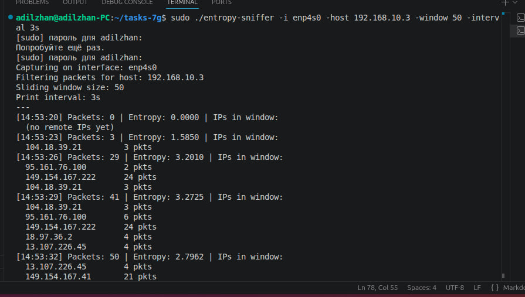

# Задания по разработке

Репозиторий содержит решения трёх задач на Go.

```
├── task1/      — Задача 1: Анализатор энтропии сетевых пакетов
├── task2/      — Задача 2: Sender + Receiver (sniffer + analyzer)
│   ├── sender/
│   ├── receiver/
│   └── common/
├── task3/      — Задача 3: Подсчёт частоты слов
└── screenshots/
```

## Требования

- Linux
- Go 1.22+
- libpcap-dev

```bash
sudo apt-get install -y golang-go libpcap-dev
```

---

# Задача 1 — Анализатор энтропии сетевых пакетов

## Как запустить

```bash
cd task1
go mod tidy
go build -o entropy-sniffer .
sudo ./entropy-sniffer -i <интерфейс> -host <ip> [-window N] [-interval длительность]
```

`sudo` нужен потому что чтение сетевых пакетов — привилегированная операция.

### Флаги

| Флаг | Что делает | По умолчанию |
|------|-----------|--------------|
| `-i` | Какой сетевой интерфейс слушать (например `eth0`, `enp4s0`) | обязательный |
| `-host` | По какому IP фильтровать пакеты | обязательный |
| `-window` | Сколько последних пакетов держать в окне | 100 |
| `-interval` | Как часто выводить результат | 5s |

### Пример

```bash
sudo ./entropy-sniffer -i enp4s0 -host 192.168.10.3 -window 50 -interval 3s
```

```
[14:27:05] Packets: 50 | Entropy: 3.2516 | IPs in window:
  8.8.8.8              12 pkts
  142.250.74.46        28 pkts
  93.184.216.34        10 pkts
```

Остановить — `Ctrl+C`.



## Как реализовал

### Почему Go и libpcap

Выбрал **Go** — горутины позволяют ловить пакеты в одном потоке и выводить результат в другом. Библиотека `gopacket` оборачивает libpcap и поддерживает BPF-фильтры (фильтрация прямо в ядре — быстро и эффективно).

DPDK не стал использовать — требует hugepages, специальные драйверы, кучу настроек. Для этой задачи перебор.

### Структура кода

| Файл | Что делает |
|------|-----------|
| `main.go` | Точка входа, парсинг флагов, основной цикл вывода |
| `capture.go` | Открытие интерфейса, BPF-фильтр, горутина захвата пакетов |
| `window.go` | Скользящее окно (PacketInfo, добавление, снимок) + mutex |
| `entropy.go` | Расчёт энтропии Шеннона |

### Ключевые решения

**Захват пакетов.** Открываю интерфейс через pcap и ставлю BPF-фильтр — ненужные пакеты не доходят до программы:
```go
handle, err := pcap.OpenLive(*iface, 65535, true, pcap.BlockForever)
handle.SetBPFFilter(fmt.Sprintf("host %s", *hostIP))
```

**Скользящее окно.** Храню размеры последних N пакетов в слайсе. Когда окно полное — удаляю старый:
```go
if len(window) >= *windowSize {
    window = window[1:]
}
window = append(window, size)
```

**Расчёт энтропии.** Формула Шеннона: `H = -Σ p(x) * log2(p(x))`. Смотрю, какие размеры встречаются в окне, считаю частоту каждого и вычисляю энтропию. Чем разнообразнее размеры — тем выше число.

- **Энтропия ~0** — все пакеты одного размера, однотипный трафик (ping)
- **Энтропия 3–4+** — разные размеры, активный трафик (сайты + DNS + видео)

**Два параллельных процесса.** Горутина ловит пакеты и кладёт в окно. Основной поток — таймер, каждые N секунд считает энтропию и выводит. Между ними mutex от гонки.

**Размер пакета как символ для энтропии** — самая естественная характеристика. Одинаковые размеры = однородный трафик, разные = разнообразный.

---

# Задача 2 — Sender + Receiver (sniffer + analyzer)

## Как запустить

Сборка:
```bash
# Sender
cd task2/sender
go mod tidy
go build -o sender .

# Receiver
cd ../receiver
go mod tidy
go build -o receiver .
```

Запуск (в двух терминалах):
```bash
# Терминал 1 — сначала receiver
sudo ./task2/receiver/receiver -interval 3s

# Терминал 2 — потом sender
sudo ./task2/sender/sender -i enp4s0 -host 192.168.10.3
```

### Флаги sender

| Флаг | Что делает | По умолчанию |
|------|-----------|--------------|
| `-i` | Сетевой интерфейс | обязательный |
| `-host` | IP для фильтрации | обязательный |
| `-sock` | Путь к Unix-сокету | `/tmp/packet_analyzer.sock` |

### Флаги receiver

| Флаг | Что делает | По умолчанию |
|------|-----------|--------------|
| `-sock` | Путь к Unix-сокету | `/tmp/packet_analyzer.sock` |
| `-interval` | Интервал вывода статистики | 5s |

### Что увидите

```
=== Stats (14:27:05) ===
Most packets: 192.168.10.3 (342 packets)
Most bytes:   142.250.74.46 (128456 bytes)
Total unique IPs: 5
```

Остановить — `Ctrl+C` в обоих терминалах.

## Как реализовал

### Архитектура

Две отдельные программы + общий модуль с форматом данных:

```
task2/
├── common/     — общий протокол передачи данных
├── sender/     — захват пакетов и отправка
└── receiver/   — приём данных и статистика
```

**common** — отдельный Go-модуль с форматом сообщений. Обе программы импортируют его, поэтому sender и receiver гарантированно говорят на одном языке.

### Связь между программами — Unix-сокет

Выбрал **Unix domain socket** для IPC:
- Быстрее TCP — нет сетевого стека, данные не покидают ядро
- Работает как обычное соединение (connect/accept/read/write)
- Легко заменить на TCP, если нужно вынести на разные машины

### Протокол — бинарный, 15 байт на пакет

Структура `PacketInfo` содержит 5-tuple + длину пакета:

| Поле | Размер | Описание |
|------|--------|----------|
| SrcIP | 4 байта | IP-адрес отправителя |
| DstIP | 4 байта | IP-адрес получателя |
| SrcPort | 2 байта | Порт отправителя |
| DstPort | 2 байта | Порт получателя |
| Proto | 1 байт | Протокол (TCP=6, UDP=17, ICMP=1) |
| Length | 2 байта | Размер пакета в байтах |

**Почему бинарный, а не JSON?** 15 байт vs ~200 байт. При высокой нагрузке разница огромная. Фиксированный размер — receiver читает ровно по 15 байт через `io.ReadFull()`, не нужны разделители или длина сообщения. Порядок байт — big-endian (сетевой стандарт).

### Sender — захват и отправка

1. Подключается к Unix-сокету (receiver должен уже слушать)
2. Открывает интерфейс через libpcap с BPF-фильтром
3. Парсит каждый пакет — IPv4-заголовок (IP, протокол), TCP/UDP-заголовок (порты), длина
4. Сериализует в 15 байт и отправляет

```go
ip := ipLayer.(*layers.IPv4)
info.Proto = uint8(ip.Protocol)
copy(info.SrcIP[:], ip.SrcIP.To4())
copy(info.DstIP[:], ip.DstIP.To4())
```

Для ICMP порты остаются 0 — у ICMP нет портов, это корректно.

### Receiver — приём и статистика

1. Создаёт Unix-сокет и слушает подключения
2. Для каждого sender'а — горутина, читающая PacketInfo через `Decode()`
3. Обновляет статистику по каждому IP (пакеты + байты)
4. По таймеру выводит IP с макс. пакетами и IP с макс. байтами

**Статистика в слайсе** `[]HostStats`, не в map. Линейный поиск по IP — уникальных IP обычно десятки-сотни, на таком объёме линейный поиск быстрее map из-за отсутствия хеширования и лучшей локальности кэша.

**Mutex** защищает слайс — одна горутина пишет (приём), другая читает (таймер).

**Несколько sender'ов** — receiver принимает подключения в цикле `Accept()`, каждое в отдельной горутине.

### Ключевые решения

- **Бинарный протокол** — минимальный размер, без парсинга, фиксированная длина
- **BPF-фильтр** — фильтрация на уровне ядра, sender не тратит CPU на ненужные пакеты
- **Слайс вместо map** — для малого числа уникальных IP быстрее и проще
- **Graceful shutdown** — обе программы обрабатывают Ctrl+C, корректно закрывают ресурсы

---

# Задача 3 — Подсчёт частоты слов

## Как запустить

```bash
cd task3
go build -o wordfreq .
./wordfreq <путь к файлу>
```

`sudo` не нужен — программа просто читает файл.

### Пример

```bash
./wordfreq test.txt
```

```
     19 go
     16 sender
     16 receiver
     16 ip
     10 window
      8 s
      7 task
      6 unix
      6 sudo
      6 host
```

Программа выведет 20 самых частых слов с количеством вхождений. Если слов меньше 20 — выведет сколько есть.

Работает и с бинарными файлами — не падает:
```bash
./wordfreq /bin/ls
```

## Как реализовал

### Ограничения задачи

По условию запрещены `map` и `string`. Поэтому:
- Слова хранятся как `[]byte` (массив байт)
- Вместо `map[string]int` используется слайс `[]WordCount` с линейным поиском

### Как работает

Программа читает файл **побайтово** через `bufio.Reader`:

1. Если байт — буква (a-z, A-Z) → добавляем в текущее слово (приводим к lowercase)
2. Если не буква → текущее слово закончилось, ищем его в слайсе:
   - Нашли → увеличиваем счётчик
   - Не нашли → добавляем новую запись с count=1
3. После чтения всего файла — сортируем по убыванию count
4. Выводим первые 20

### Структура кода

Один файл `main.go`, 4 функции:

| Функция | Что делает |
|---------|-----------|
| `countWordsInFile()` | Читает файл побайтово, собирает слова, возвращает слайс с подсчётами |
| `findAndIncrement()` | Ищет слово в слайсе — нашёл: count++, не нашёл: добавляет новое |
| `isLetter()` | Проверяет, является ли байт ASCII-буквой |
| `toLower()` | Переводит заглавную букву в строчную (A→a — разница 32 в ASCII) |

### Ключевые решения

- **Побайтовое чтение** — безопасно для бинарных файлов, не грузим весь файл в память
- **Слайс вместо map** — по условию задачи map запрещён. Линейный поиск через `bytes.Equal()`
- **[]byte вместо string** — по условию задачи string запрещён. При сохранении слова делаем копию через `copy()`, иначе все записи будут ссылаться на один буфер
- **Формат вывода** — `%7d %s` совпадает с выводом `uniq -c`, как требуется в задании
